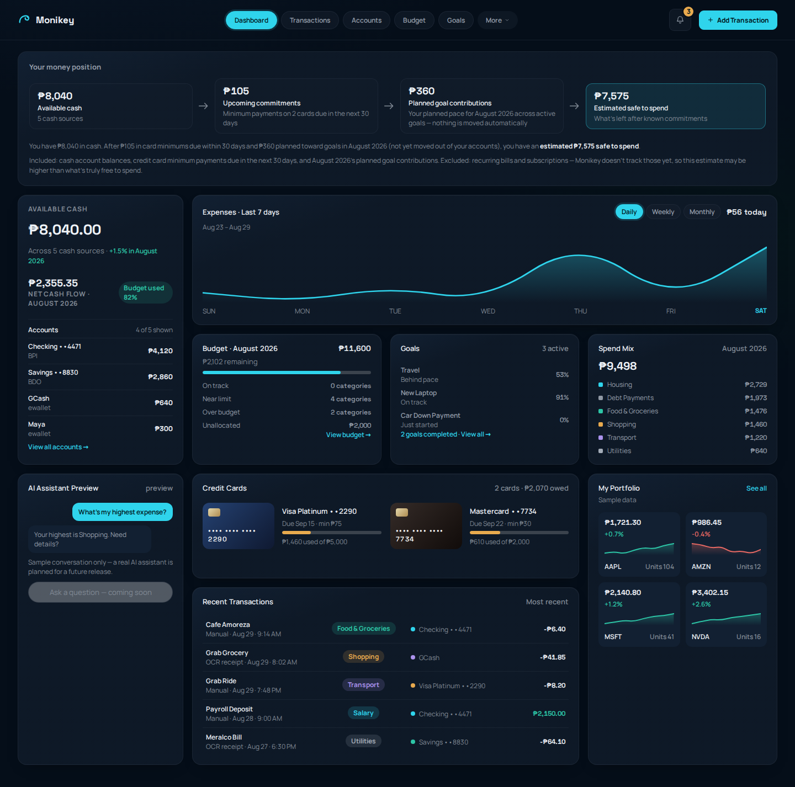
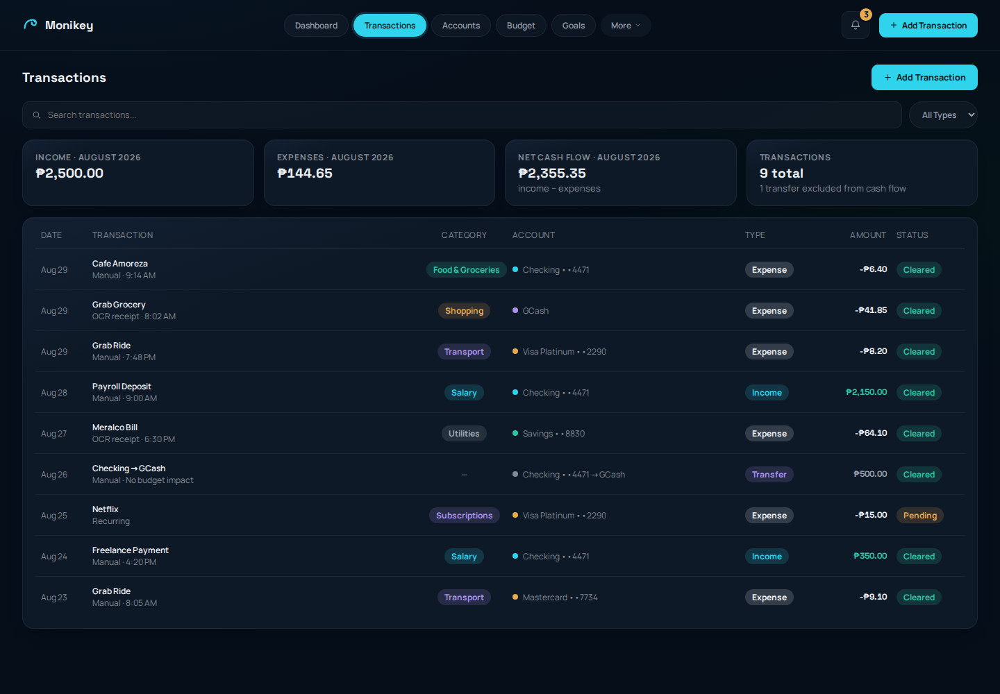
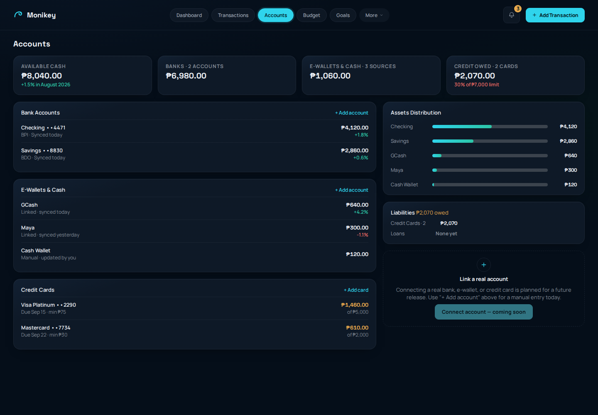
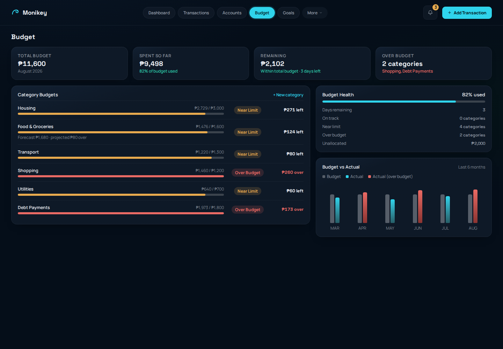
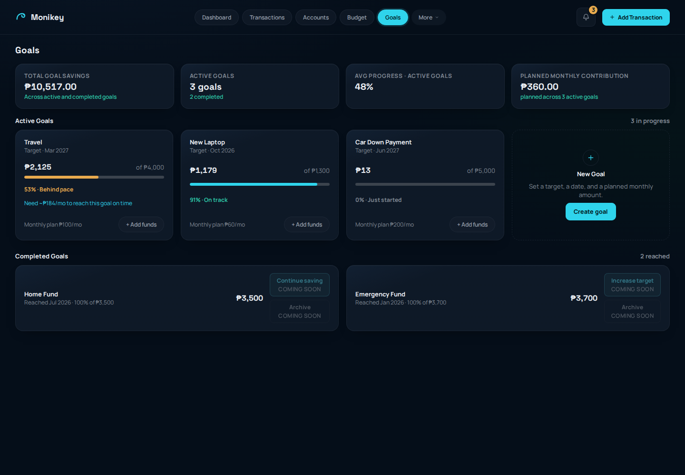
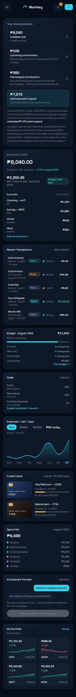

# Monikey

Monikey is a personal finance tracker: expenses, income, budgets, multi-account
bank/e-wallet money tracking, credit-card tracking, and savings goals, with an
AI assistant and OCR receipt capture on the product roadmap.

This repository is the **frontend implementation**, built from a set of
approved design mockups (see [`docs/`](./docs) and the linked Obsidian project
notes for the full design history). It is a React + TypeScript + Vite
single-page app with five working pages backed by real (in-memory) frontend
state, a functional Add Transaction workflow, local Account/Budget-category/
Goal creation, and an end-to-end Playwright test suite.

## What actually works vs. what's a preview

Everything below runs entirely on frontend state — no backend, no
authentication, no real bank/AI/OCR integration exists yet (see
[`docs/ARCHITECTURE.md`](./docs/ARCHITECTURE.md#no-backend-yet)):

**Implemented, real, local workflows:**
- Add a transaction (expense, income, or transfer) — validated, saved to
  state, and reflected in every total immediately.
- Pay a credit card from a cash account: cash and amount owed both fall,
  while income, expenses, and net cash flow are untouched (it is a transfer,
  not a cash-flow event).
- Add a manual bank/e-wallet/cash account, or a credit card with its real
  payment due date and minimum payment.
- Add a budget category (it consumes the unallocated pool rather than growing
  the monthly envelope).
- Create a savings goal and fund it from a named account — funding can never
  overdraw that account or push a goal past its target.

Every one of those rules lives in `frontend/src/domain/financeRules.ts` and is enforced
by the repository, not by the forms — see
[`docs/ARCHITECTURE.md#finance-invariants`](./docs/ARCHITECTURE.md#finance-invariants)
for the full list, including the asset-overdraft, credit-limit, card-payment,
and goal-overfunding rules.

**Honestly labeled as not yet built** (a real, disabled control — never a
clickable-looking dead end): connecting a real bank/e-wallet/card, OCR
receipt scanning, a live AI assistant, and archiving/continuing/increasing
the target on a completed goal. A goal's monthly contribution is likewise a
*planned* amount, not an automatic transfer — there is no recurring-transfer
engine, and the UI never claims one.

## The demo date

The app runs on one injected clock, fixed at the demo dataset's date
(**2026-08-29**), so the seeded figures read consistently whenever the app is
opened. Because that date is fixed rather than live, the UI labels its
reporting window with the real month ("August 2026") instead of an ambiguous
"this month". Appending `?today=YYYY-MM-DD` to any URL moves the whole app —
period totals, chart windows, budget days remaining, and the Add Transaction
form's default date — to that date at once. See
[`docs/ARCHITECTURE.md#the-application-clock`](./docs/ARCHITECTURE.md#the-application-clock).

## Stack

- [Vite](https://vite.dev) + React 19 + TypeScript
- [react-router-dom](https://reactrouter.com) for client-side routing
- Plain CSS (design tokens in `frontend/src/styles/tokens.css`) — no CSS framework
- [Playwright](https://playwright.dev) for end-to-end tests
- A React state layer backed by the Fastify API through `ApiFinanceGateway` in
  backend mode, with a deterministic mock adapter for local UI tests. See
  [`docs/ARCHITECTURE.md`](./docs/ARCHITECTURE.md) for the full shape.
- Currency: Philippine peso (`en-PH`/`PHP` via `Intl.NumberFormat`), see
  `frontend/src/utils/currency.ts`. The configuration is module-level and
  non-reactive, so switching currency at runtime is explicitly unsupported
  until a Settings page moves it into React state.

## Repository layout

This repo is a small monorepo with two independently-built packages, each
with its own `package.json`, lockfile, and Dockerfile:

```
frontend/   React + TypeScript + Vite SPA (this README's subject)
backend/    Fastify API + worker (see docs/ARCHITECTURE.md)
docker/     Shared/observability infra (Grafana, Prometheus) not owned by
            either package
docs/       Architecture docs and screenshots
compose.yaml, compose.dev.yaml   Local orchestration of both packages
```

All commands below are run from inside `frontend/` unless noted otherwise.

## Getting started

```bash
cd frontend
npm install
npm run dev       # http://localhost:5173
```

## Scripts

| Script | What it does |
| --- | --- |
| `npm run dev` | Start the Vite dev server |
| `npm run build` | Type-check (`tsc -b`) and build for production into `dist/` |
| `npm run preview` | Serve the production build at `http://localhost:4173` |
| `npm run lint` | Run `oxlint` |
| `npm run test` | Run the Vitest unit-test suite (`financeSelectors.ts`, `clock.ts`, `date.ts`, `money.ts`, `financeRules.ts` via the repository, `financeStore.ts`, `FinanceProvider.tsx`) |
| `npm run test:e2e:install` | Install the pinned Playwright Chromium build and its system dependencies (once per machine / in CI) |
| `npm run test:e2e` | Run the Playwright end-to-end suite — its web server runs `npm run build && npm run preview`, so it builds once and serves that build |
| `npm run screenshots` | Build and regenerate the screenshots under `../docs/screenshots/` |

The repo root also has a thin `package.json` with `--prefix`-delegating
convenience scripts (e.g. `npm run dev:frontend`, `npm run test:backend`) for
working across both packages without `cd`-ing back and forth.

### Running the end-to-end tests

```bash
cd frontend
npm run test:e2e:install   # once per machine: downloads Chromium + system deps
npm run test:e2e
```

`npm run test:e2e` is self-contained from a clean checkout. Playwright's
`webServer` command (in `playwright.config.ts`) is
`npm run build && npm run preview`, and Playwright starts that server **once**
per run, before any worker — so exactly one production build happens, no
matter how many parallel workers run.

That build always happens: `reuseExistingServer` is `false` everywhere, not
just in CI, so a preview server you already had running on port 4173 is never
adopted (which would have skipped the build and quietly tested whatever
`dist/` that server held). If the port is already in use the run fails loudly
instead. `e2e/tr-remediation.spec.ts` backs this up by checking that the
bundle the server hands out is the one sitting in `dist/` after this run's
build — so stale output is caught, not just a missing build.

It then runs every spec in `e2e/` against `http://localhost:4173`, covering
navigation, the Add Transaction workflow (including saving each transaction
type end-to-end), the local Account/Card/Budget-category/Goal workflows, the
credit-card payment flow, cross-page data consistency, clock rollover,
expense-chart window labeling, form-error accessibility and text legibility,
responsive behavior at 390px and 200% zoom, and the financial-invariant
regression checks in `e2e/sr012-invariants.spec.ts` and
`e2e/tr-remediation.spec.ts`.

The frontend logic itself (the clock, date/money parsing, selectors, the
domain rules, the mock repository, the field-error hook, and the state
store/provider) also has a Vitest unit suite — run with `npm run test`.

The browser binary is the one prerequisite `npm run test:e2e` does not
install for you. If Chromium is missing or its system libraries
(`libnss3`, `libnspr4`, `libasound2`, …) are absent, Playwright fails to
launch before any test runs — that is an environment problem, not an
application failure. `npm run test:e2e:install` is the fix, and it is the
same command CI should run.

## Pages

| Route | Page |
| --- | --- |
| `/` | Dashboard — money position, available cash, expenses trend, budget, goals, spend mix, credit cards, portfolio, recent transactions |
| `/transactions` | Transactions — search, filter, and add income/expense/transfer |
| `/accounts` | Accounts — banks, e-wallets, cash, and credit cards; add a manual account or card |
| `/budget` | Budget — category budgets, Budget Health, Budget vs Actual; add a category |
| `/goals` | Goals — active and completed savings goals; add funds or create a goal |
| `/investments`, `/recurring`, `/reports`, `/settings` | Honest "coming soon" placeholders behind the "More" menu |

## Responsive

Verified with zero horizontal overflow at 320px, 390px (mobile), 640px
(equivalent to 200% zoom at 1280px), 768px (tablet), 1024px (small desktop),
and 1440px (desktop). Essential financial text is never rendered below 12px,
and every form field associates its own error message via `aria-invalid` /
`aria-describedby`, focusing the first invalid control on a failed submit. Below 760px the top nav
collapses into a compact menu button; below 768px the Transactions page
shows a stacked card list instead of the desktop grid; the Add Transaction
dialog goes full-screen below 520px.

## Screenshots

| | |
| --- | --- |
|  |  |
|  |  |
|  |  |

## Documentation

- [`docs/ARCHITECTURE.md`](./docs/ARCHITECTURE.md) — component structure, the
  frontend state boundary, CSS isolation, currency, honest interactions,
  what's implemented vs. deferred, and how this maps to the original design
  docs.
- The full design history (implementation briefs, QA passes, the frontend
  review brief, and the Claude Design canvas mockups this app was built from)
  lives in the project's Obsidian vault under `03 Projects/Monikey/` — not
  duplicated here, since it predates and exceeds the scope of this codebase.
