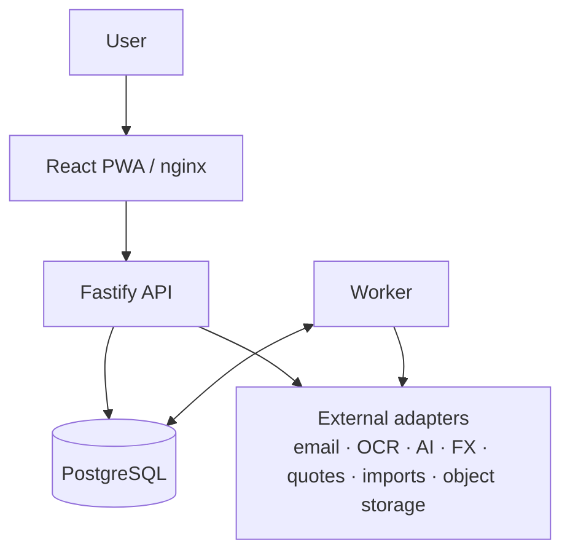
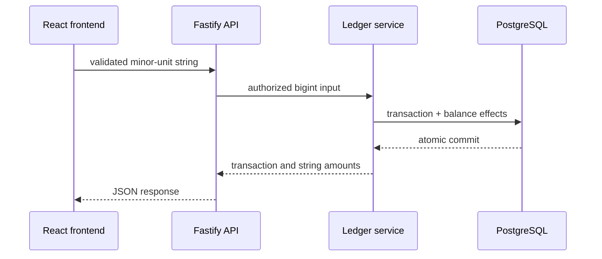
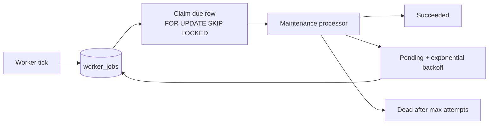
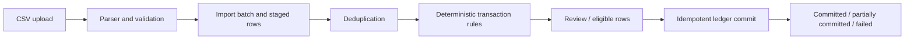

# Architecture

## System context

## Financial transaction flow

## Background job flow

## Import flow

Source reconciliation: 2026-09-12. The working `dev` branch was compared with
`origin/main` before this documentation refresh; source remains authoritative.
reviewed `main` revision, before this documentation refresh was committed. The
main-only Kubernetes API-host qualification in the nginx entrypoint is therefore
part of the `dev` release baseline. This records source reconciliation only; it
does not certify a deployment or test run.

## Process topology

The browser loads a React SPA from nginx (`web`). In backend mode its same-origin
`/api/v1` requests are proxied to Fastify (`api`), which uses Prisma/PostgreSQL
(`db`). A separate `worker` process uses the same backend image and database.
Compose gates both backend processes on the one-shot `migrate` service, which
runs `prisma migrate deploy` only. Demo data is never seeded by production
startup; use the explicit `db:seed:demo` workflow with opt-in flags. Only web port 8080 is
published by the base Compose file. Local PostgreSQL is version 18; CI uses 16.

`compose.dev.yaml` changes the API and worker to source mounts and `tsx watch`.
`compose.observability.yaml` contains optional monitoring infrastructure.

## Frontend state boundary

`frontend/src/main.tsx` selects the runtime at build time:

| Mode | Provider and data path |
| --- | --- |
| Mock | `FinanceProvider` → external `financeStore` → synchronous `FinanceRepository` / `mockFinanceRepository` |
| API | `AsyncFinanceProvider` → `BackendFinanceGate` → `ApiFinanceGateway`, recurring gateway |

The mock store uses `useSyncExternalStore`; mutations execute against its latest
state and rejected mutations do not publish a new state. This synchronous
repository is specifically a mock contract, not an HTTP adapter interface.

The async provider manages loading/error/retry state, calls fallible asynchronous
commands, and supplies a `FinanceContext` bridge so shared pages can keep using
`useFinance`. Pages with backend-specific operations also use the optional async
context. `BackendFinanceGate` handles registration, sign-in, session recovery and
sign-out. Settings has its own API gateway. The modes do not have complete feature
parity, and tests must explicitly choose the intended mode.

`domain/` holds types and frontend validation; `state/financeSelectors.ts` holds
shared derived calculations; `hooks/` exposes those values to pages. Recurring
and settings features also have dedicated domain/hooks/gateway code. Crypto V1
is active at `/investments`; broader investment accounting is partial.
The actual nine-route table is `frontend/src/App.tsx`; none of those routes uses
`Placeholder.tsx`.

## Clock, dates and currency

Mock mode injects `AppClock`, defaults to `2026-08-29`, and accepts a validated
`?today=YYYY-MM-DD` override. Calendar helpers use ISO dates and reporting periods
with inclusive start and exclusive end.

API mode does not receive that injected clock. Its `FinanceContext` bridge derives
`todayIso` from `new Date().toISOString().slice(0, 10)`; backend bootstrap and workers
handle dates separately. Do not claim a single injected clock across the full stack.

The shared money formatter uses module-level `en-PH`/`PHP` configuration.
`setCurrencyConfig` does not cause React rerenders; the existing Settings page
therefore keeps runtime currency/locale selection disabled. Backend currency and
FX fields do not make every frontend monetary display currency-aware.

## Money Position commitment scope

`safeToSpendBreakdown` subtracts credit-card minimums, recurring bills due within
the configured horizon, and planned goal contributions from available cash,
floored at zero. The estimate is deterministic and does not use AI.

## Finance invariants

Mock mutations call `domain/financeRules.ts`. The API enforces authorization,
validation and balance effects in its services and database transactions;
`backend/src/modules/ledger/` is the central ledger boundary. SQL migrations also
carry constraints/triggers not fully expressible in Prisma's schema.

- Transfers are excluded from income/expense totals, including credit-card
  payments and investment principal movements.
- Asset overdrafts, credit-limit violations, card overpayment and goal overfunding
  are rejected by the relevant mutation paths.
- Goal funding debits the source account and records funded savings. A goal's
  planned monthly contribution is distinct from a recurring automatic payment.
- Category/account ownership and cross-user isolation must be enforced by the
  backend, regardless of frontend validation.

Use the regression tests and raw SQL migrations for exact edge cases; a frontend
validator alone is not proof that an API operation preserves an invariant.

## Client idempotency keys

Create requests carry opaque idempotency keys so retries can be recognized by the
API. `frontend/src/utils/idempotencyKey.ts` uses `crypto.randomUUID()` where it is
available. Browsers that expose Web Crypto without `randomUUID` use random bytes;
environments with no Web Crypto use a timestamp/random fallback. These keys are
for collision avoidance, not authentication or secret material. The transaction
modal keeps one generated key for a pending submission.

## Backend modules and workers

`backend/src/app.ts` constructs the app, providers and route modules. It registers
health, authentication, settings, accounts, ledger, bootstrap, budgets, goals,
recurring, receipts, reports, insights, imports, reconciliation and rules under
`/api/v1`. Crypto routes are also registered under the investments-era module
boundary.
Swagger UI and `/openapi.json` are available in development. Production keeps
them disabled unless `PUBLIC_API_DOCS=true` is explicitly set; nginx may proxy
them only when that exposure is intentional.

Authentication uses Argon2id passwords, random session tokens with only their
hashes stored, HttpOnly/SameSite=Lax cookies, and Secure cookies in production.
State-changing browser routes enforce the configured origin. Rate limiting,
request IDs, centralized error handling and redacted Pino logging are implemented.

`backend/src/worker.ts` schedules daily maintenance in PostgreSQL and claims due
rows from `worker_jobs` with `FOR UPDATE SKIP LOCKED`. Jobs support deduplication,
stale-lock recovery, exponential retry and a terminal dead state. The worker
process still owns the recurring, notification, snapshot, quote and FX handlers;
PostgreSQL provides durable scheduling without adding a broker.

Ledger mutation requests use validated decimal minor-unit strings at the JSON
boundary and normalize them to `bigint`; core ledger validation, balance effects,
reversals, updates, and goal funding remain bigint-only. Other read-model/report
serializers still have separate display-number compatibility boundaries.

The API exposes Prometheus text metrics at `/api/v1/metrics`, including request
and error counters and cumulative request duration. Metrics intentionally avoid
user IDs and other high-cardinality financial labels.

The daily durable maintenance job also removes expired sessions. Authentication
does not depend on this cleanup: expired sessions are rejected at request time.

Provider interfaces/adapters cover FX, quotes, OCR, AI insights, object storage,
email and bank import. Live adapters need their configured providers/credentials;
CI uses stubs. Plaid is sandbox-only. Receipt data is stored on the shared local
volume in Compose; PostgreSQL and receipt files need separate backups.

## Crypto and investment boundary

The user-facing route is cryptocurrency-oriented and is labelled Crypto in the
frontend. Backend crypto routes, quote providers, FX adapters, and the
investment-era Prisma models remain active/retained. Broader securities
accounting, mixed-currency historical valuation, and complete cash-account
selectors are partial; this is not yet a general brokerage ledger.

## UI and accessibility

Shared CSS lives in `frontend/src/styles/global.css`, design tokens in
`styles/tokens.css`, and page styles beside their pages. Shared components include
AppShell, AddTransactionModal, MoneyPosition, Card, Sparkline, ProgressBar,
StatusBadge, Toast and the authentication gate. Forms use native controls,
validation feedback and dialog patterns. Responsive and accessibility assertions
exist in Playwright; historical screenshots/test reports are not a fresh UI audit.

## Testing

Frontend Vitest covers selectors, validation, state/providers, gateways and page
interactions. Backend Vitest includes both unit and integration files, serializing
files to avoid races on shared database fixtures. Full integration coverage needs
PostgreSQL. Playwright separates mock tests from tagged `@backend-compose` tests;
external base URLs bypass its local build/preview server.

Use commands in [README](../README.md#verification-commands) and distinguish local
checks from the jobs actually enabled in [CI](CI-CD-Operations.md).

## Known limitations

- Investment account selectors, FX-unavailable UI treatment, historical currency
  capture and fully converted mixed-currency aggregate returns remain unfinished.
- Plaid access-token storage still has encryption TODOs; very large import amounts
  have an explicit bigint-to-Number precision FIXME.
- Expired sessions are rejected/opportunistically removed, but a periodic cleanup
  sweep remains unimplemented.
- Disabled UI includes bank connection, free-form AI questions, PDF export,
  currency switching and two-factor auth. CSV export and custom ranges are
  implemented in the reports page.
- The `frontend` package's `test:backend:compose` script changes to the repository
  root before running `scripts/test-compose-backend-regression.sh`.
